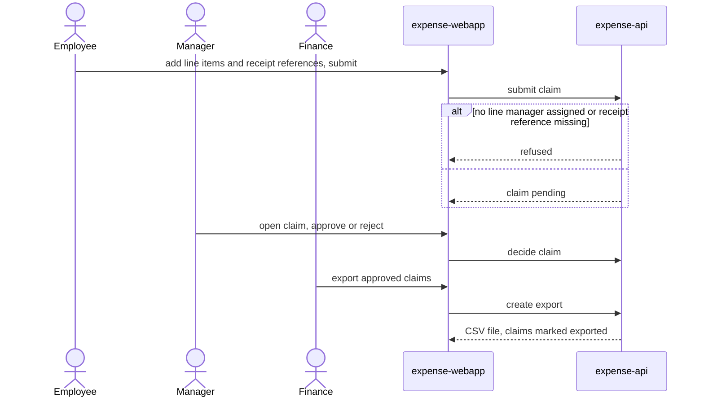

# Claim to payroll

An employee submits a claim, the line manager approves it, and finance exports it to payroll.

```mermaid
sequenceDiagram
    actor Employee
    actor Manager
    actor Finance
    participant expense-webapp
    participant expense-api

    Employee->>expense-webapp: add line items and receipt references, submit
    expense-webapp->>expense-api: submit claim
    alt no line manager assigned or receipt reference missing
        expense-api-->>expense-webapp: refused
    else
        expense-api-->>expense-webapp: claim pending
    end
    Manager->>expense-webapp: open claim, approve or reject
    expense-webapp->>expense-api: decide claim
    Finance->>expense-webapp: export approved claims
    expense-webapp->>expense-api: create export
    expense-api-->>expense-webapp: CSV file, claims marked exported
```